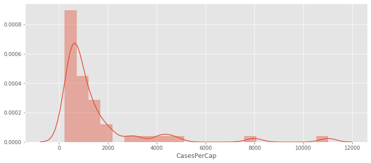
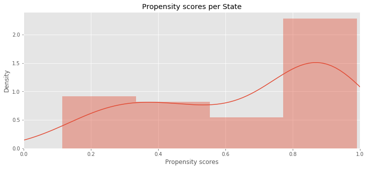

```python
import numpy as np
import pandas as pd
from pathlib import Path
import statsmodels.api as sm
import statsmodels.formula.api as smf
from sklearn.linear_model import LogisticRegression
from sklearn.calibration import CalibratedClassifierCV
from sklearn.preprocessing import StandardScaler
from imblearn.over_sampling import SMOTE
from imblearn.pipeline import Pipeline
import matplotlib.pyplot as plt
import seaborn as sns
%matplotlib inline
plt.style.use('ggplot')

np.random.RandomState(42)
```


    RandomState(MT19937) at 0x1A45597360


```python
data = pd.read_stata('COVID.dta')
```


```python
data.set_index('StateName', inplace=True)
```


```python
data['Lockdown'] = 1 - data['Strategy']
data['CasesPerCap'] = data['Cases']/(data['Population'])
data['Intercept'] = 1
```


```python
data.head()
```


<div>
<style scoped>
    .dataframe tbody tr th:only-of-type {
        vertical-align: middle;
    }

    .dataframe tbody tr th {
        vertical-align: top;
    }

    .dataframe thead th {
        text-align: right;
    }
</style>
<table border="1" class="dataframe">
  <thead>
    <tr style="text-align: right;">
      <th></th>
      <th>Population</th>
      <th>Density</th>
      <th>Age</th>
      <th>Income</th>
      <th>POC</th>
      <th>Strategy</th>
      <th>Cases</th>
      <th>Deaths</th>
      <th>Governor</th>
      <th>Lockdown</th>
      <th>CasesPerCap</th>
      <th>Intercept</th>
    </tr>
    <tr>
      <th>StateName</th>
      <th></th>
      <th></th>
      <th></th>
      <th></th>
      <th></th>
      <th></th>
      <th></th>
      <th></th>
      <th></th>
      <th></th>
      <th></th>
      <th></th>
    </tr>
  </thead>
  <tbody>
    <tr>
      <th>Alabama</th>
      <td>4.9</td>
      <td>93.500000</td>
      <td>39.900002</td>
      <td>48.099998</td>
      <td>31.500000</td>
      <td>0.0</td>
      <td>4241.0</td>
      <td>123.0</td>
      <td>0.0</td>
      <td>1.0</td>
      <td>865.510193</td>
      <td>1</td>
    </tr>
    <tr>
      <th>Alaska</th>
      <td>1.3</td>
      <td>1.300000</td>
      <td>34.000000</td>
      <td>73.000000</td>
      <td>33.299999</td>
      <td>0.0</td>
      <td>293.0</td>
      <td>9.0</td>
      <td>0.0</td>
      <td>1.0</td>
      <td>225.384628</td>
      <td>1</td>
    </tr>
    <tr>
      <th>Arizona</th>
      <td>7.3</td>
      <td>57.000000</td>
      <td>37.400002</td>
      <td>56.599998</td>
      <td>27.000000</td>
      <td>0.0</td>
      <td>3692.0</td>
      <td>142.0</td>
      <td>0.0</td>
      <td>1.0</td>
      <td>505.753418</td>
      <td>1</td>
    </tr>
    <tr>
      <th>Arkansas</th>
      <td>3.0</td>
      <td>56.400002</td>
      <td>37.900002</td>
      <td>45.900002</td>
      <td>23.000000</td>
      <td>1.0</td>
      <td>1599.0</td>
      <td>34.0</td>
      <td>0.0</td>
      <td>0.0</td>
      <td>533.000000</td>
      <td>1</td>
    </tr>
    <tr>
      <th>California</th>
      <td>39.5</td>
      <td>253.600006</td>
      <td>36.299999</td>
      <td>71.199997</td>
      <td>27.900000</td>
      <td>0.0</td>
      <td>26838.0</td>
      <td>864.0</td>
      <td>1.0</td>
      <td>1.0</td>
      <td>679.443054</td>
      <td>1</td>
    </tr>
  </tbody>
</table>
</div>


```python
f, ax1 = plt.subplots(1, 1,
                       figsize=(12, 5),
)

sns.distplot(data['CasesPerCap'], ax=ax1)
```


    <matplotlib.axes._subplots.AxesSubplot at 0x1a4dd8c048>





### Model 1: Predict the Strategy


```python
X = data[['Population', 'Density', 'Age', 'Income', 'POC', 'Governor']].copy()
y = data['Lockdown']

lr = Pipeline(
    steps = [('scale', StandardScaler()),
             ('smote', SMOTE()),
             ('clf', CalibratedClassifierCV(LogisticRegression()))
            ]   
)

lr.fit(X, y)
```


    Pipeline(memory=None,
             steps=[('scale',
                     StandardScaler(copy=True, with_mean=True, with_std=True)),
                    ('smote',
                     SMOTE(k_neighbors=5, n_jobs=None, random_state=None,
                           sampling_strategy='auto')),
                    ('clf',
                     CalibratedClassifierCV(base_estimator=LogisticRegression(C=1.0,
                                                                              class_weight=None,
                                                                              dual=False,
                                                                              fit_intercept=True,
                                                                              intercept_scaling=1,
                                                                              l1_ratio=None,
                                                                              max_iter=100,
                                                                              multi_class='auto',
                                                                              n_jobs=None,
                                                                              penalty='l2',
                                                                              random_state=None,
                                                                              solver='lbfgs',
                                                                              tol=0.0001,
                                                                              verbose=0,
                                                                              warm_start=False),
                                            cv=None, method='sigmoid'))],
             verbose=False)


```python
propensity = pd.DataFrame(lr.predict_proba(X), index=data.index)
propensity.sort_values(by=1)
```


<div>
<style scoped>
    .dataframe tbody tr th:only-of-type {
        vertical-align: middle;
    }

    .dataframe tbody tr th {
        vertical-align: top;
    }

    .dataframe thead th {
        text-align: right;
    }
</style>
<table border="1" class="dataframe">
  <thead>
    <tr style="text-align: right;">
      <th></th>
      <th>0</th>
      <th>1</th>
    </tr>
    <tr>
      <th>StateName</th>
      <th></th>
      <th></th>
    </tr>
  </thead>
  <tbody>
    <tr>
      <th>Utah</th>
      <td>0.885211</td>
      <td>0.114789</td>
    </tr>
    <tr>
      <th>Idaho</th>
      <td>0.829723</td>
      <td>0.170277</td>
    </tr>
    <tr>
      <th>Wyoming</th>
      <td>0.787564</td>
      <td>0.212436</td>
    </tr>
    <tr>
      <th>Nebraska</th>
      <td>0.780540</td>
      <td>0.219460</td>
    </tr>
    <tr>
      <th>North Dakota</th>
      <td>0.777525</td>
      <td>0.222475</td>
    </tr>
    <tr>
      <th>Alaska</th>
      <td>0.731256</td>
      <td>0.268744</td>
    </tr>
    <tr>
      <th>South Dakota</th>
      <td>0.713944</td>
      <td>0.286056</td>
    </tr>
    <tr>
      <th>Iowa</th>
      <td>0.694327</td>
      <td>0.305673</td>
    </tr>
    <tr>
      <th>Arkansas</th>
      <td>0.691609</td>
      <td>0.308391</td>
    </tr>
    <tr>
      <th>Oklahoma</th>
      <td>0.689812</td>
      <td>0.310188</td>
    </tr>
    <tr>
      <th>Miss.</th>
      <td>0.628254</td>
      <td>0.371746</td>
    </tr>
    <tr>
      <th>westVa</th>
      <td>0.599544</td>
      <td>0.400456</td>
    </tr>
    <tr>
      <th>Indiana</th>
      <td>0.587710</td>
      <td>0.412290</td>
    </tr>
    <tr>
      <th>Missouri</th>
      <td>0.572347</td>
      <td>0.427653</td>
    </tr>
    <tr>
      <th>Arizona</th>
      <td>0.521740</td>
      <td>0.478260</td>
    </tr>
    <tr>
      <th>Vermont</th>
      <td>0.517116</td>
      <td>0.482884</td>
    </tr>
    <tr>
      <th>Tennessee</th>
      <td>0.484107</td>
      <td>0.515893</td>
    </tr>
    <tr>
      <th>Alabama</th>
      <td>0.457458</td>
      <td>0.542542</td>
    </tr>
    <tr>
      <th>South Carolina</th>
      <td>0.455838</td>
      <td>0.544162</td>
    </tr>
    <tr>
      <th>NH</th>
      <td>0.409368</td>
      <td>0.590632</td>
    </tr>
    <tr>
      <th>Georgia</th>
      <td>0.360213</td>
      <td>0.639787</td>
    </tr>
    <tr>
      <th>Kansas</th>
      <td>0.326550</td>
      <td>0.673450</td>
    </tr>
    <tr>
      <th>Montana</th>
      <td>0.275294</td>
      <td>0.724706</td>
    </tr>
    <tr>
      <th>Ohio</th>
      <td>0.255613</td>
      <td>0.744387</td>
    </tr>
    <tr>
      <th>Kentucky</th>
      <td>0.235285</td>
      <td>0.764715</td>
    </tr>
    <tr>
      <th>Louisiana</th>
      <td>0.204839</td>
      <td>0.795161</td>
    </tr>
    <tr>
      <th>Colorado</th>
      <td>0.198929</td>
      <td>0.801071</td>
    </tr>
    <tr>
      <th>Oregon</th>
      <td>0.189515</td>
      <td>0.810485</td>
    </tr>
    <tr>
      <th>Nevada</th>
      <td>0.187040</td>
      <td>0.812960</td>
    </tr>
    <tr>
      <th>Minnesota</th>
      <td>0.172457</td>
      <td>0.827543</td>
    </tr>
    <tr>
      <th>Mass.</th>
      <td>0.170310</td>
      <td>0.829690</td>
    </tr>
    <tr>
      <th>Texas</th>
      <td>0.159084</td>
      <td>0.840916</td>
    </tr>
    <tr>
      <th>Wisconsin</th>
      <td>0.159045</td>
      <td>0.840955</td>
    </tr>
    <tr>
      <th>Maine</th>
      <td>0.132447</td>
      <td>0.867553</td>
    </tr>
    <tr>
      <th>Washington</th>
      <td>0.129153</td>
      <td>0.870847</td>
    </tr>
    <tr>
      <th>New Mexico</th>
      <td>0.126684</td>
      <td>0.873316</td>
    </tr>
    <tr>
      <th>Maryland</th>
      <td>0.117469</td>
      <td>0.882531</td>
    </tr>
    <tr>
      <th>Michigan</th>
      <td>0.090870</td>
      <td>0.909130</td>
    </tr>
    <tr>
      <th>Delaware</th>
      <td>0.086381</td>
      <td>0.913619</td>
    </tr>
    <tr>
      <th>North Carolina</th>
      <td>0.083646</td>
      <td>0.916354</td>
    </tr>
    <tr>
      <th>Florida</th>
      <td>0.076075</td>
      <td>0.923925</td>
    </tr>
    <tr>
      <th>Virginia</th>
      <td>0.067992</td>
      <td>0.932008</td>
    </tr>
    <tr>
      <th>Illinois</th>
      <td>0.067635</td>
      <td>0.932365</td>
    </tr>
    <tr>
      <th>RI</th>
      <td>0.063837</td>
      <td>0.936163</td>
    </tr>
    <tr>
      <th>Penn.</th>
      <td>0.051516</td>
      <td>0.948484</td>
    </tr>
    <tr>
      <th>Hawaii</th>
      <td>0.051411</td>
      <td>0.948589</td>
    </tr>
    <tr>
      <th>Connecticut</th>
      <td>0.042087</td>
      <td>0.957913</td>
    </tr>
    <tr>
      <th>New York</th>
      <td>0.022219</td>
      <td>0.977781</td>
    </tr>
    <tr>
      <th>New jersey</th>
      <td>0.013840</td>
      <td>0.986160</td>
    </tr>
    <tr>
      <th>California</th>
      <td>0.008292</td>
      <td>0.991708</td>
    </tr>
  </tbody>
</table>
</div>


```python
f, ax1 = plt.subplots(1, 1,
                       figsize=(12, 5),
)

sns.distplot(propensity[1], ax=ax1)
ax1.set_xlim(0, 1)
ax1.set_title("Propensity scores per State")
ax1.set_xlabel("Propensity scores")
ax1.set_ylabel('Density');
```





### Model 2: Use the Strategy probabilities as weights in a subsequent regression


```python
data['Iptw'] =  1./ propensity.lookup(data.index, data['Strategy'])
```


```python
X = data[['Population', 'Density', 'Age', 'Income', 'POC', 'Lockdown', 'Governor', 'Intercept']].copy()
y = data['CasesPerCap']

glm = sm.GLM(y, X, 
             family=sm.families.NegativeBinomial(),
             freq_weights=data['Iptw'])
res = glm.fit()
res.summary()
```


<table class="simpletable">
<caption>Generalized Linear Model Regression Results</caption>
<tr>
  <th>Dep. Variable:</th>      <td>CasesPerCap</td>   <th>  No. Observations:  </th>  <td>    50</td> 
</tr>
<tr>
  <th>Model:</th>                  <td>GLM</td>       <th>  Df Residuals:      </th> <td>  535.02</td>
</tr>
<tr>
  <th>Model Family:</th>    <td>NegativeBinomial</td> <th>  Df Model:          </th>  <td>     7</td> 
</tr>
<tr>
  <th>Link Function:</th>          <td>log</td>       <th>  Scale:             </th> <td>  1.0000</td>
</tr>
<tr>
  <th>Method:</th>                <td>IRLS</td>       <th>  Log-Likelihood:    </th> <td> -4704.4</td>
</tr>
<tr>
  <th>Date:</th>            <td>Thu, 23 Apr 2020</td> <th>  Deviance:          </th> <td>  326.75</td>
</tr>
<tr>
  <th>Time:</th>                <td>19:51:48</td>     <th>  Pearson chi2:      </th>  <td>  497.</td> 
</tr>
<tr>
  <th>No. Iterations:</th>         <td>16</td>        <th>                     </th>     <td> </td>   
</tr>
<tr>
  <th>Covariance Type:</th>     <td>nonrobust</td>    <th>                     </th>     <td> </td>   
</tr>
</table>
<table class="simpletable">
<tr>
       <td></td>         <th>coef</th>     <th>std err</th>      <th>z</th>      <th>P>|z|</th>  <th>[0.025</th>    <th>0.975]</th>  
</tr>
<tr>
  <th>Population</th> <td>   -0.0015</td> <td>    0.004</td> <td>   -0.344</td> <td> 0.731</td> <td>   -0.010</td> <td>    0.007</td>
</tr>
<tr>
  <th>Density</th>    <td>    0.0027</td> <td>    0.000</td> <td>   15.224</td> <td> 0.000</td> <td>    0.002</td> <td>    0.003</td>
</tr>
<tr>
  <th>Age</th>        <td>    0.0133</td> <td>    0.031</td> <td>    0.427</td> <td> 0.670</td> <td>   -0.048</td> <td>    0.074</td>
</tr>
<tr>
  <th>Income</th>     <td>   -0.0522</td> <td>    0.007</td> <td>   -7.409</td> <td> 0.000</td> <td>   -0.066</td> <td>   -0.038</td>
</tr>
<tr>
  <th>POC</th>        <td>    0.0088</td> <td>    0.004</td> <td>    2.428</td> <td> 0.015</td> <td>    0.002</td> <td>    0.016</td>
</tr>
<tr>
  <th>Lockdown</th>   <td>   -0.3632</td> <td>    0.260</td> <td>   -1.396</td> <td> 0.163</td> <td>   -0.873</td> <td>    0.147</td>
</tr>
<tr>
  <th>Governor</th>   <td>    0.7309</td> <td>    0.141</td> <td>    5.170</td> <td> 0.000</td> <td>    0.454</td> <td>    1.008</td>
</tr>
<tr>
  <th>Intercept</th>  <td>    9.0590</td> <td>    1.300</td> <td>    6.970</td> <td> 0.000</td> <td>    6.512</td> <td>   11.606</td>
</tr>
</table>


We are modelling 

$$ \log{CasesPerCap} = \beta_0 + \beta_{Lockdown}*X_{Lockdown} + \beta_{Density}*X_{Density} + \beta_{Age}*X_{age} + \beta_{Income}*X_{Income} + \beta_{POC}*X_{POC} + + \beta_{Governor}*X_{Governor} $$

which means conditional on all other covariates being the same, when a state has lockdown the mean number of Cases per Capita decreases by:

$$ \log{Y_1} - \log{Y_0} = \log{\frac{Y_1}{Y_0}} \sim -0.36 $$

Where 


$$ Y_1 = \mathrm{CasesPerCap}, X_{Lockdown = 1} $$

and Y_0 is defined similarly.

Which means, that keeping all other covariates the same, imposing a lockdown caused about 36% fewer cases per capita, and this has an 16% chance of happening by random.

Given the small sample size this is probably the best p-value we will get.


```python

```
