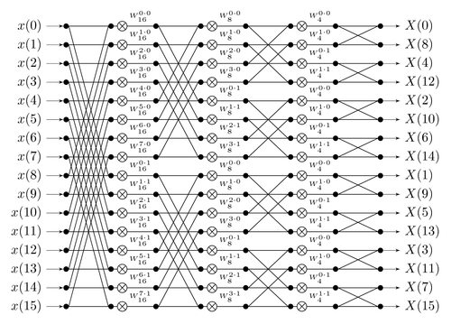

# Breaking it all down

Since it's Joseph Fourier's birthday, I'll write a little about his central idea and why it's so important.

One of the most important ideas in mathematics, is that you can build complex things out of simple things. In the context I'm talking about this time: we can often break a vector on a vector space down into a sum of simpler vectors which span the space we're interested in. 

As an example, consider the plane \\( \mathrm{R}^2 \\) and the two vectors \\( e_1 = (1, 0)^T \\) and \\( e_2 = (0, 1)^T \\). We can write *any* vector in that plane as a sum  of those two vectors:

$$ (40.2, 3.0)^T = 40.2 * e_1 + 3.0 e_2 $$

This idea extends to any dimension \\( n > 2 \\). What's more amazing, is that this idea can also work for spaces with infinite dimensions! In these infinite spaces, a vector is now a function, and we seek to express the function in terms of simpler ones. 

In school (and university) we were taught about the functions \\( \mathrm{sin}(x) \\) and \\( \mathrm{cos}(x) \\), these functions have the usefull properties that:

$$ \int_0^{2\pi} cos(x) dx  = 0 $$

$$ \int_0^{2\pi} sin(x) dx  = 0 $$

and that

$$ \int_0^{2\pi} cos(x) sin(x) dx  = 0 $$

Because of these (admittedly quite arbitrary properties) \\( sin \\) and \\( cos \\) can play the role for functions that \\( e_1 \\) and \\( e_2 \\) played for vectors. This was Joseph Fourier's insight, and there's not a part of Science/Engineering that has been left untouched (mainly because if you're out of ideas about what to do in a data analysis, taking a Fourier Transform will seldom be  a bad one). 

In the rest of this post, we'll consider an effcient way of computing a discrete version of the Fourier Tansform

If we have a vector \\( x  \in \mathrm{R}^N \\) which we can write it's Fourier Transform as:

$$ X_k = \sum_{n=0}^{N-1} x_n e^{-i2\pi kn/N} $$ 

Or, more compactly in matrix notation:

$$ X_k = W x_n $$

with $$ W_{kn} = e^{-i2\pi kn/N} $$ 

Naively, we could simply compute the FT by doing some matrix multiplication:


```python
import numpy as np

x = np.random.randn(1024)

def DFT(x):

    X = np.zeros_like(x)
    N = x.shape[0]
    n = np.arange(N)
    k = n.reshape((N, 1))
    W = np.exp(-1.0*(2j * np.pi * k * n /N))
    X = W @ x
    return X

X = DFT(x)
```

We can check to see if we're right:


```python
np.allclose(X, np.fft.fft(x))
```


    True


However, there's a much better way of computing the FT by exploiting some symmetries of W. First of all we'll show that $ X_{k + N} = X_k $ and then how this insight can be turned into a recursive algorithm for computing $X_k$.

Firstly

$$ X_{k + N} = \sum_{n=0}^{N-1} x_n e^{-i2\pi (k+N)n/N}  $$


$$ = \sum_{n=0}^{N-1} x_n e^{-i2\pi n} e^{-i2\pi kn/N} $$

$$ = \sum_{n=0}^{N-1} x_n e^{-i2\pi kn/N} $$

because \\( e^{i2\pi n} = 1 \\) for any \\( n \\). 

The trick for computing the FT, which makes use of this symmetry, is to perform an FT on the odd and even parts of $ x $ respectively:

$$ X_{k} = \sum_{m=0}^{N/2-1} x_{2m} e^{-i2\pi (2m)n/N} + \sum_{m=0}^{N/2-1} x_{2m+1} e^{-i2\pi (2m+1)n/N} $$

$$ X_{k} = \sum_{m=0}^{N/2-1} x_{2m} e^{-i2\pi (2m)n/N} + e^{-i 2\pi k/N} \sum_{m=0}^{N/2-1} x_{2m+1} e^{-i2\pi (2m)n/N} $$

What that these two lines show, is that we can split an \\( N \\) length FT into two \\( N/2 \)) length Fts, with the second multiplied by some factor. We need not stop there though, as we can continue this splitting trick all the way down to \\( m = 1 \\), which is what this graphic shows



In python, we can write the FFT as like so:


```python
def FFT(x):
    N = x.shape[0]
    
    if N % 2 > 0:
        return x
    else:
        X_even = FFT(x[::2])
        X_odd = FFT(x[1::2])
        factor = np.exp(-2j * np.pi * np.arange(N) / N)
        return np.concatenate([X_even + factor[:(N // 2)] * X_odd, X_even + factor[(N // 2):] * X_odd])
```


```python
X = FFT(x)
np.allclose(X, np.fft.fft(x))
```


    True


